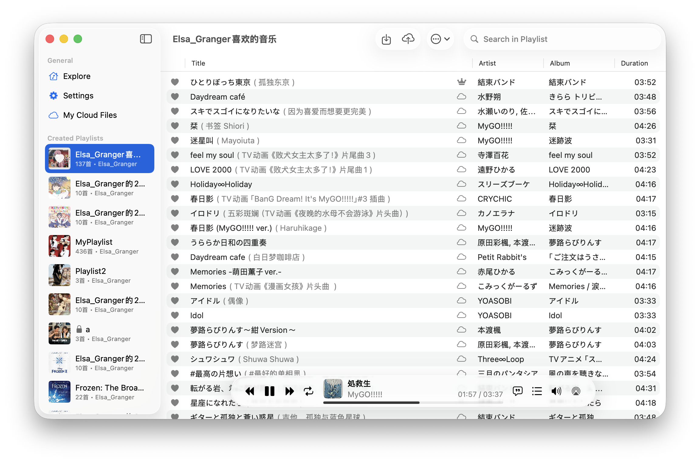
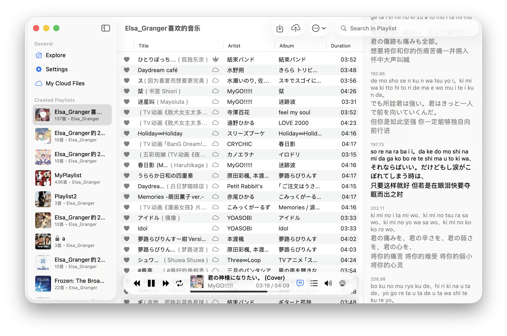
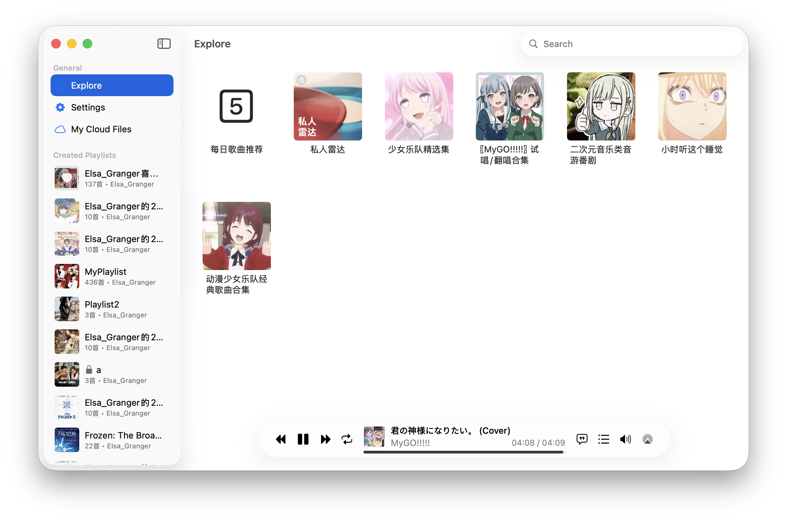

# MusicBox

用 SwiftUI 实现的网易云播放器

## 功能特性

### 🎵 音频播放
- 基于 AVPlayer 实现音频播放，支持空间音频
- 渐进式缓存：播放的同时下载并缓存音频文件
- 智能歌词同步：精确到 0.1 秒的歌词显示
- 多种播放模式：顺序播放、随机播放、单曲循环
- "播放下一首"队列功能
- 支持媒体键控制（播放/暂停、上一首/下一首）

### 🎤 歌词功能
- 实时歌词显示与滚动
- 支持翻译歌词和罗马音显示
- 时间戳显示功能
- 歌词界面可显示当前播放进度

### 📚 播放列表管理
- 支持网易云音乐歌单浏览和播放
- 每日推荐歌曲
- 个人创建和收藏的歌单
- 歌曲搜索和搜索建议
- 歌曲收藏功能（红心歌曲）
- 播放历史记录（Scrobble）

### ☁️ 云盘功能
- 直接上传本地音乐文件至网易云音乐云盘
- 自动匹配上传文件与在线歌曲
- 云盘文件管理和播放
- 支持拖拽上传音乐文件

### 🔐 账户系统
- 二维码扫码登录
- 手机号密码登录
- 自动保持登录状态
- 用户信息显示

### 🖥️ 系统集成
- 原生 macOS 界面，支持深色模式
- 状态栏音乐控制集成
- 通知中心媒体信息显示
- 全局空格键播放/暂停快捷键
- 播放时防止系统休眠（可配置）
- 窗口关闭时隐藏而非退出应用
- 自动更新功能（Sparkle 框架）

### 🎛️ 播放控制
- 完整的播放控制界面
- 进度条拖拽（缓存完成后可用）
- 音量控制
- 播放状态显示（加载中、播放中、暂停等）

### 💾 数据管理
- 播放状态和播放列表自动保存
- 音乐文件缓存管理
- API 响应缓存优化
- 应用设置持久化

## Novelty

- 基于 AVPlayer 实现音频播放，可以实现空间音频
- 直接上传至音乐云盘并与在线歌曲进行匹配
- 原生界面
- 智能歌词同步系统

## Screenshots

歌单界面



歌词与播放列表



每日推荐等



与系统的继承，在 Menu Bar 中控制音乐播放


设置界面，与 AirPlay 的集成，支持在其他设备上播放音乐，但是不影响系统的音频输出


## Note & Usage

- 建议使用扫码登录，如果登陆失败，需要进行验证，建议直接从网页端复制 Cookie，使用 "Cookie Login" 功能进行登录
- 播放的时候会在 ~/Music/MusicBox 下边播放边进行缓存，文件名以网易云的歌曲 ID 命名，默认为可以下载到的最高音质
  - 第一次播放时的缓存过程中因为存在跳转的目标与实际播放目标不匹配的问题，禁用了拖动进度条功能，待到缓存完成后才可拖动进度条
  - 在歌单的功能栏处的 "Download All"  按钮会在后台对所有歌曲进行缓存
  -  分别是将当前的歌单替换为播放列表和添加当前歌单添加到播放列表
- 歌单、歌词的加载缓存，如果需要对歌单进行刷新，可以点 "Refresh Playlist"  按钮
- 点左下角的歌曲封面会切换到歌词界面
  - 歌词界面右上角  分别是显示某一句歌词的时间戳和显示罗马音（如果有）

## Installation from GitHub Action

要求 macOS 14 及以上

下载 [Github Action Release](https://github.com/zeyugao/MusicBox/actions/workflows/build.yml) 里面的 Artifacts

解压后执行来签名

```shell
xattr -dr com.apple.quarantine ./MusicBox.app
codesign -fs - -f --entitlements ./MusicBox.entitlements ./MusicBox.app
```

## Acknowledgment

- [QCloudMusicApi](https://github.com/s12mmm3/QCloudMusicApi): 网易云 API 接口
- [CachingPlayerItem](https://github.com/sukov/CachingPlayerItem): 音频缓存
- [AudioStreaming](https://github.com/dimitris-c/AudioStreaming)
- [iOSAACStreamPlayer](https://github.com/UFOooX/iOSAACStreamPlayer)
- [YesPlayMusic](https://github.com/qier222/YesPlayMusic): Logo

